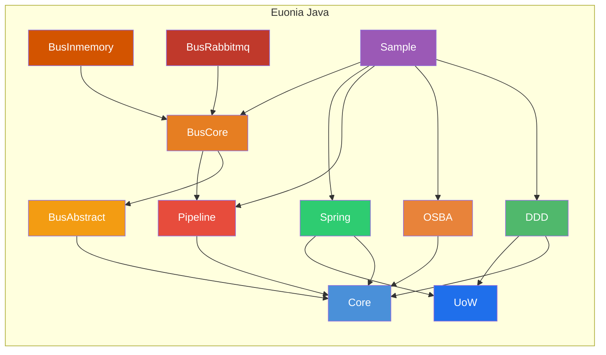

# Euonia (Java)

> *Eunoia* — from Greek *εὔνοια*: beautiful thinking, goodwill, a well-disposed mind.

Euonia is a development framework for building enterprise Java applications. It combines **Object-Oriented Scalable Business Architecture (OSBA)** with **Domain-Driven Design (DDD)** principles to provide a comprehensive foundation for creating robust, maintainable business applications. The framework is built on **Java 17+** and integrates seamlessly with **Spring Boot**.

Euonia is also available for **[.NET](https://github.com/NerosoftDev/Euonia)** — this repository hosts the **Java edition**.

---

## Modules



### Core (`euonia-core`)
> Foundation library: base classes, ID generation, reflection utilities, tuples, HTTP exceptions, security, and validation annotations.

| Package | Description |
|---------|-------------|
| `com.euonia.core` | Unified `ObjectId` (supports Snowflake, UUID, ULID, Random), `SnowflakeId`, `ULID`, `ShortUniqueId`, `Singleton<T>`, `PriorityQueue`, `Pair<L,R>` |
| `com.euonia.tuple` | Immutable typed tuples: `Solo`, `Duet`, `Trio`, `Quartet`, `Quintet`, `Sextet`, `Septet`, `Octet`, `Nonet`, `Decet` |
| `com.euonia.http` | HTTP status exceptions: `BadRequestException` (400), `UnauthorizedAccessException` (401), `ForbiddenException` (403), `ResourceNotFoundException` (404), `ConflictException` (409), and more |
| `com.euonia.security` | `UserPrincipal`, `UserClaimTypes`, `AuthenticationException`, `CredentialException`, `UnauthorizedAccessException` |
| `com.euonia.annotation` | `@Required`, `@Validator`, `@Validation` — metadata for field validation |
| `com.euonia.reflection` | `TypeHelper`, `GenericType<T>`, `@DisplayName` |

### DDD (`euonia-domain-driven-design`)
> Domain-Driven Design abstractions: entities, aggregates, value objects, domain events, and auditing support.

| Class | Purpose |
|-------|---------|
| `Entity<ID>` / `EntityBase<ID>` | Base interface and abstract class for domain entities with identity |
| `Aggregate<ID>` / `AggregateBase<ID>` | Aggregate root with domain event management (`raiseEvent`, `clearEvents`, `attachEvents`) |
| `ValueObject<T>` | Immutable value object with reflection-based `equals`, `hashCode`, and `compareTo` |
| `DomainEvent` / `DomainEventBase` | Domain event contract with aggregate attachment and event metadata |
| `ApplicationEvent` / `ApplicationEventBase` | Application-level event base classes |
| `EventAggregate` | Event metadata wrapper: id, eventId, typeName, originator, timestamp, sequence |
| `@Audited` / `AuditRecord` / `AuditStore` | Change auditing support for domain entities |

### UoW (`euonia-unit-of-work`)
> Unit of Work abstraction for transaction boundaries, commit/rollback lifecycle, and consistent persistence orchestration.

| Class / Interface | Purpose |
|-------------------|---------|
| `IUnitOfWork` | Unit-of-work contract with lifecycle methods (`saveChanges`, `commit`, `rollback`) |
| `IUnitOfWorkManager` | Creates/manages current unit-of-work scope |
| `UnitOfWork` | Default unit-of-work implementation |
| `UnitOfWorkBase` | Base class for shared transaction flow |
| `UnitOfWorkInterceptor` | Intercepts application flow to attach UoW boundaries |
| `IUnitOfWorkAccessor` | Access current active unit-of-work context |

### Pipeline (`euonia-pipeline`)
> Middleware pipeline framework inspired by ASP.NET Core pipeline pattern — chainable request/response processing with behaviors, delegates, and dependency injection integration.

| Interface / Class | Description |
|-------------------|-------------|
| `Pipeline` | Pipeline builder: chain components via `use()`, build delegate, run async |
| `PipelineBase` | Abstract base with component registration, reverse-chain build, and `@PipelineBehaviors` annotation support |
| `PipelineDelegate` | `FunctionalInterface`: `CompletionStage<Void> invoke(Object context)` |
| `PipelineBehavior` | Behavior interface: `CompletionStage<Void> handleAsync(Object, PipelineDelegate)` |
| `PipelineFactory` / `DefaultPipelineFactory` | Factory for creating `Pipeline` and `RequestResponsePipeline` instances |
| `DefaultPipelineProvider` | Default implementation resolving behaviors via `ServiceProvider` (reflection or DI) |
| `RequestResponsePipeline<TRequest, TResponse>` | Typed pipeline with request/response — supports `runAsync(TRequest)` |
| `RequestResponsePipelineBase<TRequest, TResponse>` | Abstract base for typed pipelines |
| `RequestResponsePipelineBehavior<TRequest, TResponse>` | Typed behavior: `handleAsync(TRequest, PipelineDelegate)` |
| `RequestResponsePipelineDelegate<TRequest, TResponse>` | Typed delegate: `CompletionStage<TResponse> invoke(TRequest)` |
| `RequestPipelineDelegate<TRequest>` | Fire-and-forget typed delegate: `CompletionStage<Void> invoke(TRequest)` |
| `@PipelineBehaviors` | Annotation to auto-attach behaviors by context type |

**Key features:**
- Fluent API: chain behaviors via `.use()` with lambda, class, or `@PipelineBehaviors` discovery
- Supports both void-pipeline (`Pipeline`) and request/response pipeline (`RequestResponsePipeline`)
- Delegate-based composition with reverse-chain construction (innermost executes first)
- `ServiceProvider` abstraction enables both standalone and Spring-integrated usage
- Async throughout via `CompletionStage`

```java
// Create a pipeline
Pipeline pipeline = new DefaultPipelineProvider(resolver)
    .use((ctx, next) -> next.invoke(ctx).thenRun(() -> System.out.println("Log: done")))
    .use(LoggingBehavior.class);

// Run
pipeline.runAsync(new MyContext()).toCompletableFuture().join();
```

### Bus Abstract (`euonia-bus-abstract`)
> Foundational messaging abstractions: message contracts, conventions, transport strategies, metadata, and marker annotations for the bus layer. Depends on `core`.

| Class / Interface | Purpose |
|-------------------|---------|
| `MessageContext` | Runtime message context: reply, failure, and completion event publishers |
| `MessageContextBase` | Abstract context implementation with event handling |
| `HandlerContext` | Handler-level context contract |
| `RoutedMessage` | Message envelope: payload, IDs, correlation ID, metadata, and headers |
| `MessageEnvelope` | Lightweight message wrapper for transport |
| `MessageMetadata` | Message metadata: type, correlation, conversation IDs |
| `MessageHeaders` | Key-value message header collection |
| `MessageBusOptions` | Bus configuration options |
| `Dispatcher` | Dispatch contract for resolving transport names |
| `MessageRegistration` | Handler registration record |
| `MessageConvention` / `DefaultMessageConvention` / `AnnotationMessageConvention` | Convention system for classifying messages (unicast/multicast/request) |
| `BaseMessageConvention` / `MessageConventionBuilder` | Convention aggregator and builder |
| `TransportStrategy` / `BaseTransportStrategy` / `AnnotationTransportStrategy` | Transport selection strategies |
| `LocalMessageTransportStrategy` / `DistributedMessageTransportStrategy` | Local vs. distributed transport selection |
| `@Command` / `@Event` / `@Request` | Message type marker annotations |
| `Queue` / `Topic` / `Request` | Contract-based message type marker interfaces |
| `Transport` | Transport contract interface |
| `MessageSubscribedEvent` / `MessageProcessedEvent` | Lifecycle event DTOs |

### Bus Core (`euonia-bus-core`)
> Runtime orchestration layer: handler discovery, registration, dispatch, and bus API. Depends on `pipeline` and `bus-abstract`.

| Class / Interface | Purpose |
|-------------------|---------|
| `Bus` | Top-level bus interface for `send`, `publish`, `call` operations |
| `MessageBus` | Bus implementation shell |
| `Handler<M, R>` | Typed message handler interface |
| `StrategicDispatcher` | Dispatcher that resolves transport names via configured strategies |
| `MessageHandlerFinder` | Scans classes for `@Subscribe` methods and `Handler` implementations |
| `DefaultHandlerContext` | Runtime handler resolution and invocation via `ServiceProvider` |
| `MessageHandler` / `MessageHandlerFactory` | Handler wrapper and factory for per-channel dispatch |
| `PipelineMessage` | Wraps message execution through `RequestResponsePipeline` |
| `MessageCache` | Centralized channel naming (defaults to FQCN, `@Channel` override) |
| `SendOptions` / `PublishOptions` / `CallOptions` | Typed operation options |
| `ExtendableOptions` | Base class for extensible option sets |

**Key features:**
- Discovers handlers via `@Subscribe` annotated methods or `Handler<M,R>` interface
- Single-handler channels support request/response (unicast); multi-handler channels run in parallel (multicast)
- `TransportStrategy` system maps message types to transports (local vs. distributed)
- Integrates with Pipeline for middleware-style message processing

### Bus InMemory (`euonia-bus-inmemory`)
> In-memory transport adapter (scaffold). Provides local message dispatch without external infrastructure.

### Bus RabbitMQ (`euonia-bus-rabbitmq`)
> RabbitMQ transport adapter (scaffold). Provides distributed message dispatch via RabbitMQ broker.

### Spring (`euonia-spring`)
> Spring Framework integration module. Bridges `ServiceProvider` with Spring's `ApplicationContext` for seamless dependency injection in pipeline and other Euonia components.

| Class | Description |
|-------|-------------|
| `ApplicationContextServiceProvider` | `ServiceProvider` implementation backed by Spring's `ApplicationContext` — supports `getBeanProvider`, `autowireBean`, and constructor-argument-based bean creation |
| `ServiceProviderConfiguration` | Spring `@Configuration` auto-wiring `ServiceProvider` as a bean |

**Key features:**
- Enables Spring DI for pipeline behaviors and other Euonia components
- Auto-wires Spring-managed beans into pipeline delegates
- Fallback to reflection-based construction with autowiring support
- Minimal setup: just `@Import(ServiceProviderConfiguration.class)` or component-scan

### OSBA (`euonia-osba`)
> **Object-Oriented Scalable Business Architecture** — a rich business object framework with rule-based validation, property change tracking, state management, and reflection-driven factories.

#### Business Object Hierarchy

```
BusinessObject<B>          — Core: rules, context, property management
    └── ObservableObject<T>  — Change tracking: NEW / CHANGED / DELETED state
        ├── EditableObject<T>  — Savable with async rule validation
        ├── ReadOnlyObject<T>  — Immutable with permission-based access
        └── ExecutableObject<T> — Template-based operation execution
```

#### Key Concepts

| Concept | Description |
|---------|-------------|
| **BusinessContext** | Service locator and object factory holder; injects context and initializes rules |
| **PropertyInfo<T>** | Typed property metadata: name, type, friendly name, default value, field reference |
| **FieldDataManager** | Per-instance reflection-based field value management |
| **Rule System** | Async rule validation with `RuleManager` (per-type singleton) & `Rules` (per-instance executor) |
| **ObjectEditState** | Lifecycle state machine: `NONE → NEW → CHANGED → DELETED` |
| **ObjectFactory** | Reflection-driven CRUD factory: `@FactoryCreate`, `@FactoryFetch`, `@FactoryInsert`, `@FactoryUpdate`, `@FactoryDelete`, `@FactoryExecute` |

#### Rule System

```java
protected void addRules() {
    getRules().addRule(new LambdaRule<>(age, (a, ctx) -> a != null && a >= 18, "Must be 18+"));
}
```

| Class | Description |
|-------|-------------|
| `Rule` | Interface: `getName()`, `getProperty()`, `getPriority()`, `executeAsync(RuleContext)` |
| `LambdaRule<T>` | Lambda-based: `(value, context) → boolean` |
| `RegularRule` | Method-based execution |
| `RequiredRule` | Non-null property validation |
| `BrokenRule` / `BrokenRuleCollection` | Validation result with severity (ERROR, WARNING, INFO) |
| `RuleCheckException` | Thrown on validation failure |

---

## Sample Application

The `sample` module demonstrates **Euonia framework integration with Spring Boot 4.0**:

| Component | Description |
|-----------|-------------|
| **`User` aggregate** | `EditableObject<User>` with `@FactoryCreate`, custom rules (`UserNameRule`, `LambdaRule`), and Snowflake ID generation |
| **`OsbaConfiguration`** | Wires `BusinessObjectFactory` with Spring's `ApplicationContext` |
| **`UserController`** | REST API: `POST /api/user`, `GET /api/user/{id}` — using `ObjectFactory` to create/fetch aggregates |

### Tech Stack

| Category | Technology |
|----------|-----------|
| **Language** | Java 17+ (sample uses Java 25) |
| **Framework** | Spring Boot 4.0 (Spring MVC, Spring Data JPA, Spring Framework 7.0) |
| **Database** | MySQL, H2 (in-memory for testing) |
| **API Docs** | SpringDoc OpenAPI 3.0 |
| **Build** | Maven |
| **ID Generation** | Snowflake, UUID, ULID |
| **Pipeline** | Custom middleware pipeline (chain-of-responsibility / middleware pattern) |
| **DI Integration** | Spring `ApplicationContext` via `ServiceProvider` abstraction |

---

## Quick Start

### Maven Dependencies

```xml
<!-- Core utilities -->
<dependency>
    <groupId>com.euonia</groupId>
    <artifactId>core</artifactId>
    <version>1.0.0</version>
</dependency>

<!-- Pipeline middleware -->
<dependency>
    <groupId>com.euonia</groupId>
    <artifactId>pipeline</artifactId>
    <version>1.0.0</version>
</dependency>

<!-- Spring Integration -->
<dependency>
    <groupId>com.euonia</groupId>
    <artifactId>spring</artifactId>
    <version>1.0.0</version>
</dependency>

<!-- Business objects (OSBA) -->
<dependency>
    <groupId>com.euonia</groupId>
    <artifactId>osba</artifactId>
    <version>1.0.0</version>
</dependency>

<!-- Domain-Driven Design -->
<dependency>
    <groupId>com.euonia</groupId>
    <artifactId>domain-driven-design</artifactId>
    <version>1.0.0</version>
</dependency>

<!-- Message Bus (abstractions) -->
<dependency>
    <groupId>com.euonia</groupId>
    <artifactId>bus-abstract</artifactId>
    <version>1.0.0</version>
</dependency>

<!-- Message Bus (core runtime) -->
<dependency>
    <groupId>com.euonia</groupId>
    <artifactId>bus-core</artifactId>
    <version>1.0.0</version>
</dependency>

<!-- Message Bus (RabbitMQ transport) -->
<dependency>
    <groupId>com.euonia</groupId>
    <artifactId>bus-rabbitmq</artifactId>
    <version>1.0.0</version>
</dependency>
```

```java
// Define a business object
@Component @Scope("prototype")
public class Order extends EditableObject<Order> {
    private final PropertyInfo<String> productName = registerProperty(String.class, "productName");

    @FactoryCreate
    protected void create(String productName) {
        super.create();
        setProductName(productName);
        setId(ObjectId.snowflake().getValue(Long.class));
    }

    @Override
    protected void addRules() {
        getRules().addRule(new RequiredRule(productName));
    }
}

// Use the factory
@Autowired
private ObjectFactory factory;

var order = factory.create(Order.class, "Widget");
order.save(false);
```

---

## Build

```bash
# Build all modules
mvn clean install

# Run the sample application
cd sample
mvn spring-boot:run
```

---

## Project Links

- **GitHub**: [github.com/NerosoftDev/euonia-java](https://github.com/NerosoftDev/euonia-java)
- **.NET Edition**: [github.com/NerosoftDev/Euonia](https://github.com/NerosoftDev/Euonia)

---

## Donate


---

[](https://www.jetbrains.com/)

Thanks to [JetBrains](https://www.jetbrains.com/) for supporting the project through [All Products Packs](https://www.jetbrains.com/products.html) within their [Free Open Source License](https://www.jetbrains.com/community/opensource) program.

---


