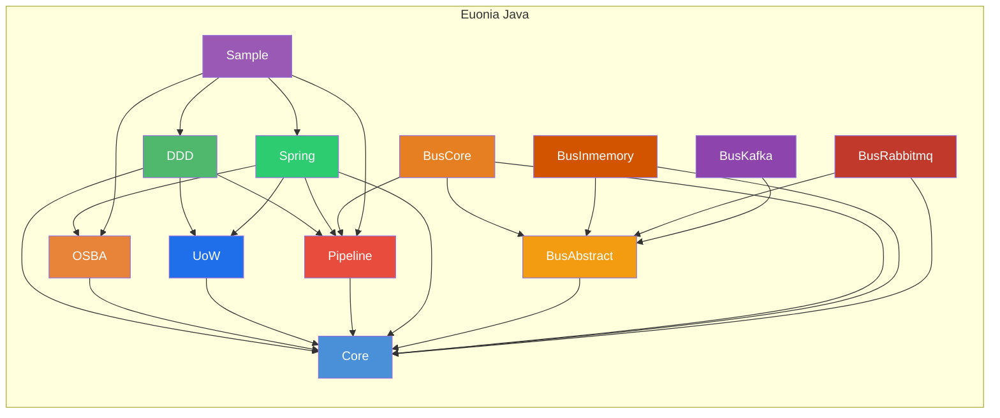

# Euonia (Java)

> *Eunoia* — from Greek *εὔνοια*: beautiful thinking, goodwill, a well-disposed mind.

Euonia is a development framework for building enterprise Java applications. It combines **Object-Oriented Scalable Business Architecture (OSBA)** with **Domain-Driven Design (DDD)** principles to provide a comprehensive foundation for creating robust, maintainable business applications. The framework is built on **Java 17+** and integrates seamlessly with **Spring Boot 4.x / Spring Framework 7.x**.

Euonia is also available for **[.NET](https://github.com/euonia-project/euonia-dotnet)** — this repository hosts the **Java edition**.

---

## Modules



### Core (`euonia-core`)
> Foundation library: base classes, ID generation, reflection utilities, tuples, HTTP exceptions, security, and validation annotations.

| Package | Description |
|---------|-------------|
| `com.euonia.core` | Unified `ObjectId` (supports Snowflake, UUID, ULID, Random), `SnowflakeId`, `ULID`, `ShortUniqueId`, `Singleton<T>`, `PriorityQueue`, `Pair<L,R>` |
| `com.euonia.tuple` | Immutable typed tuples: `Solo`, `Duet`, `Trio`, `Quartet`, `Quintet`, `Sextet`, `Septet`, `Octet`, `Nonet`, `Decet` |
| `com.euonia.http` | HTTP status exceptions: `BadRequestException` (400), `UnauthorizedAccessException` (401), `ForbiddenException` (403), `ResourceNotFoundException` (404), `ConflictException` (409), and more |
| `com.euonia.security` | `UserPrincipal`, `UserClaimTypes`, `AuthenticationException`, `CredentialException`, `UnauthorizedAccessException` |
| `com.euonia.annotation` | `@Required`, `@Validator`, `@Validation` — metadata for field validation |
| `com.euonia.reflection` | `TypeHelper`, `GenericType<T>`, `@DisplayName` |

### DDD (`euonia-domain-driven-design`)
> Domain-Driven Design abstractions: entities, aggregates, value objects, domain events, commands, application services, use cases, and auditing support.

| Package | Class | Purpose |
|---------|-------|---------|
| `com.euonia.domain` | `Entity<ID>` / `EntityBase<ID>` | Base interface and abstract class for domain entities with identity |
| `com.euonia.domain` | `Aggregate<ID>` / `AggregateBase<ID>` | Aggregate root with domain event management (`raiseEvent`, `clearEvents`, `attachEvents`) |
| `com.euonia.domain` | `HasDomainEvents` | Contract for aggregates that manage domain events and handlers |
| `com.euonia.domain` | `ValueObject<T>` | Immutable value object with reflection-based `equals`, `hashCode`, and `compareTo` |
| `com.euonia.domain.event` | `Event` / `EventBase` | Core event contract: id, sequence, intent, originator metadata |
| `com.euonia.domain.event` | `DomainEvent` / `DomainEventBase` | Domain event with aggregate attachment and `EventAggregate` projection |
| `com.euonia.domain.event` | `ApplicationEvent` / `ApplicationEventBase` | Application-level (integration) event base classes |
| `com.euonia.domain.event` | `EventAggregate` | Aggregate-shaped event data: id, eventId, typeName, originator, timestamp, sequence |
| `com.euonia.domain.command` | `Command` / `CommandBase` | Command pattern abstraction: `Command` extends `Unicast` (message bus integration), `CommandBase` provides base implementation |
| `com.euonia.domain.auditing` | `@Audited` / `AuditRecord` / `AuditStore` | Change auditing support for domain entities |
| `com.euonia.application` | `ApplicationService` / `BaseApplicationService` | Application service marker and base class with dependency resolution |
| `com.euonia.usecase` | `UseCase<I,O>` / `UseCasePresenter` | Input/output use-case contract with reactive result publishing |
| `com.euonia.usecase` | `UseCaseSuccess` / `UseCaseFailure` | Output ports for success and failure handling |

### UoW (`euonia-unit-of-work`)
> Unit of Work abstraction for transaction boundaries, commit/rollback lifecycle, and consistent persistence orchestration.

| Class / Interface | Purpose |
|-------------------|---------|
| `IUnitOfWork` | Unit-of-work contract with lifecycle methods (`saveChanges`, `commit`, `rollback`) |
| `IUnitOfWorkManager` | Creates/manages current unit-of-work scope |
| `UnitOfWork` | Default unit-of-work implementation |
| `UnitOfWorkBase` | Base class for shared transaction flow |
| `UnitOfWorkInterceptor` | Intercepts application flow to attach UoW boundaries |
| `IUnitOfWorkAccessor` | Access current active unit-of-work context |

### Pipeline (`euonia-pipeline`)
> Middleware pipeline framework inspired by ASP.NET Core pipeline pattern — unified `Pipeline<TRequest, TResponse>` with chainable behaviors, delegates, and dependency injection integration.

| Interface / Class | Description |
|-------------------|-------------|
| `Pipeline<TRequest, TResponse>` | Pipeline builder: chain components via `use()`, build delegate, run async |
| `PipelineBase<TRequest, TResponse>` | Abstract base with component registration, reverse-chain build, and `@PipelineBehaviors` annotation support |
| `PipelineDelegate<TRequest, TResponse>` | `@FunctionalInterface`: `CompletionStage<TResponse> invoke(TRequest request)` |
| `PipelineBehavior<TRequest, TResponse>` | Behavior interface: `CompletionStage<TResponse> handleAsync(TRequest, PipelineDelegate<TRequest, TResponse>)` |
| `PipelineFactory` / `DefaultPipelineFactory` | Factory for creating `Pipeline<TRequest, TResponse>` instances |
| `DefaultPipelineProvider<TRequest, TResponse>` | Default implementation resolving behaviors via `ServiceProvider` (reflection or DI) |
| `@PipelineBehaviors` | Annotation to auto-attach behaviors by context type |

**Key features:**
- Fluent API: chain behaviors via `.use()` with lambda, class, or `@PipelineBehaviors` discovery
- Single `Pipeline<TRequest, TResponse>` for both fire-and-forget (`Pipeline<Object, Void>`) and typed request/response scenarios
- Delegate-based composition with reverse-chain construction (innermost executes first)
- `ServiceProvider` abstraction enables both standalone and Spring-integrated usage
- Async throughout via `CompletionStage`

```java
// Create a pipeline
Pipeline<Object, Void> pipeline = new DefaultPipelineProvider<>(resolver)
    .use((ctx, next) -> next.invoke(ctx).thenRun(() -> System.out.println("Log: done")))
    .use(LoggingBehavior.class);

// Run
pipeline.runAsync(new MyContext()).toCompletableFuture().join();
```

### Bus Abstract (`euonia-bus-abstract`)
> Foundational messaging abstractions: message envelope, context, conventions, transport strategies, annotations, abstract transport interface, inbox/outbox/dead-letter queue abstractions. Extension base for all bus modules. Depends on `core`.

**Core Contracts**

| Class / Interface | Purpose |
|-------------------|---------|
| `MessageEnvelope<T>` | Envelope contract (messageId, correlationId, conversationId, requestTrackId, channel, payload) |
| `MessageContext` | Runtime message context: message access, response (`response`), failure notification (`failure`), completion callback (`complete`) |
| `MessageContextBase` | Default `MessageContext` implementation: `SubmissionPublisher`-based response/completion event flow |
| `MessageMetadata` | Typed metadata map (`Map<String,Object>`) with `get(key, Class<T>)` accessor |
| `MessageHeaders` | Header constants: `MESSAGE_ID`, `CORRELATION_ID`, `CONVERSATION_ID`, `CONTENT_TYPE`, `REQUEST_TRACE_ID`, `AUTHORIZATION` |
| `HandlerContext` | Handler context contract: subscription events, async invocation (`handleAsync`) |
| `HandlerRegistration` | **Record** — immutable registration tuple: channel + messageType + handlerType + method |
| `Configurator` | Global configuration contract: convention builder, strategy builder (by transport name), handler registration list |
| `Dispatcher` | Dispatcher contract: `List<String> determine(Class<?>)` — messageType → transport name list |
| `MessageConventionType` | Enum: `NONE`, `UNICAST`, `MULTICAST`, `REQUEST` |
| `MessageSerializer` | Message serialization contract interface |

**Inbox / Outbox / Dead Letter Queue**

| Class / Interface | Purpose |
|-------------------|---------|
| `InboxStore` | Inbox persistence interface for message deduplication (idempotency): `insert` / `markAsSuccess` / `markAsFailed` |
| `InboxEntry` | Inbox entry: messageId, channel, messageType, handles, createdAt |
| `InboxHandle` | Per-handler status record: handler name, status (PENDING / SUCCESS / FAILED), retry count |
| `OutboxStore` | Outbox persistence interface: `insert` / `markAsPublished`, transactional message guarantee |
| `OutboxEntry` | Outbox entry: messageId, channel, payload, status, created/updated timestamps |
| `DeadLetterMessage` | Dead-letter message entity: original message, error info, failure time, retry count |

**Recipients**

| Interface | Purpose |
|-----------|---------|
| `Recipient` | Base contract: `getName()`; extends `AutoCloseable` |
| `Executor` | Marker sub-interface: unicast/request executor |
| `Subscriber` | Marker sub-interface: multicast subscriber |
| `RecipientRegistrar` | Recipient registrar: `register(List<HandlerRegistration>, defaultTransport)` |

**Contract Interfaces (Markers)**

| Interface | Purpose |
|-----------|---------|
| `Unicast` | Marker interface: point-to-point unicast message |
| `Multicast` | Marker interface: publish-subscribe multicast message |
| `Request<R>` | Marker interface: request-response message with response type `R` |
| `Transport` | Transport abstraction: `getName()`, `publishAsync`, `sendAsync`, `callAsync` |

**Annotations (10 types)**

| Annotation | Target | Purpose |
|------------|--------|---------|
| `@Subscribe` | Method | Declares a handler method; `value` = channel, `group` = consumer group |
| `@Channel` | Type | Overrides default channel name (defaults to FQCN) |
| `@Unicast` | Type | Marks as a unicast message |
| `@Multicast` | Type | Marks as a multicast message |
| `@Request` | Type | Marks as request-response with `responseType()` |
| `@LocalMessage` | Type | Marks for local transport only |
| `@DistributedMessage` | Type | Marks for distributed transport only |
| `@DispatchIn` | Type | Constrains outbound transport (`transports()`) |
| `@ReceiveIn` | Type | Constrains inbound transport (`transports()`) |
| `@Enqueue` | Type | Queue name + priority |

**Event System**

| Class | Purpose |
|-------|---------|
| `MessageProcessedEvent` | Base event: message + context + `MessageProcessType` |
| `MessageDeliveredEvent` | Message delivered |
| `MessageReceivedEvent` | Message received |
| `MessageAcknowledgedEvent` | Message acknowledged |
| `MessageRepliedEvent` | Message replied (with response payload) |
| `MessageHandledEvent` | Message handled (with handler type) |
| `MessageSubscribedEvent` | Subscription metadata |
| `MessageProcessType` | Enum: `SEND`, `DELIVERED`, `RECEIVED`, `ACKNOWLEDGED`, `REPLIED`, `HANDLED` |

**Exception Hierarchy**

| Class | Purpose |
|-------|---------|
| `MessageTypeException` | Invalid/unclassified message type |
| `MessageProcessingException` | Processing failure |
| `MessageDeliverException` | Delivery failure |
| `MessageTransportException` | Transport-layer failure |

### Bus Core (`euonia-bus-core`)
> Runtime orchestration layer: handler discovery, registration, dispatch, convention & strategy implementations, routed messages, and bus API. Depends on `bus-abstract` and `pipeline`, composing all abstract contracts into a working message bus engine.

**Core Classes**

| Class / Interface | Purpose |
|-------------------|---------|
| `Bus` | Top-level bus interface: `publishAsync` (multicast), `sendAsync` (unicast), `callAsync` (request-response), plus fluent builders `publish()` / `send()` / `call()` |
| `MessageBus` | `Bus` implementation — orchestration engine: type validation → context resolution → envelope construction → pipeline execution → dispatch decision → transport delivery |
| `RoutedMessage<T>` | Transport envelope: payload + messageId / correlationId / conversationId / requestTrackId / channel / authorization / timestamp / metadata |
| `Handler<M,R>` | Typed handler: `R handle(M message, MessageContext context)` |
| `StrategicDispatcher` | `Dispatcher` implementation: strategy matching + cardinality validation + caching, falls back to `defaultTransport` on mismatch |
| `DefaultHandlerContext` | `HandlerContext` implementation: per-channel handler registration, async invocation (single handler → response/failure, multi-handler → parallel fan-out) |
| `DefaultConfigurator` | `Configurator` implementation: fluent configuration of conventions/strategies/handlers (4 registration modes: direct, type, list, package name) |
| `MessageHandlerFinder` | Auto-discovery: `@Subscribe` annotated methods + `Handler<M,R>` interface implementations |
| `ChannelRegistrar` | Channel registrar: manages per-channel `MessageHandlerContext` lists with multi-handler parallel execution |

**Convention & Strategy Implementations**

| Class / Interface | Purpose |
|-------------------|---------|
| `MessageConvention` | Contract: `isUnicast(String channel)`, `isMulticast(String channel)`, `isRequest(String channel)` |
| `DefaultMessageConvention` | Interface-marker based convention: implements `Unicast` / `Multicast` / `Request<R>` interfaces |
| `AnnotationMessageConvention` | Annotation-based convention: `@Unicast` / `@Multicast` / `@Request` annotations |
| `BaseMessageConvention` | Composite convention engine: aggregates multiple conventions with `ConcurrentHashMap` cache |
| `OverridableMessageConvention` | Delegating convention with predicate overrides for classification results |
| `DefaultMessageConventionBuilder` | Fluent builder |
| `TransportStrategy` | Contract: `outgoing(Class<?>)`, `incoming(Class<?>)` |
| `BaseTransportStrategy` | Composite strategy engine: aggregates multiple strategies with cache |
| `DefaultTransportStrategy` | Neutral default (always returns `false`) |
| `AnnotationTransportStrategy` | Matches `@DispatchIn` / `@ReceiveIn` annotation names |
| `LocalMessageTransportStrategy` | Matches `@LocalMessage`-annotated types |
| `DistributedMessageTransportStrategy` | Matches `@DistributedMessage`-annotated types |
| `OverridableTransportStrategy` | Delegating strategy with predicate overrides |
| `DefaultTransportStrategyBuilder` | Fluent strategy builder |

**Idempotency & Pipeline Behaviors**

| Class | Purpose |
|-------|---------|
| `IdempotentHandler` | Idempotent handler decorator: checks `InboxStore` before processing to prevent duplicates; built-in retry timer for failed messages |
| `InboxPipelineBehavior` | Pipeline behavior: auto-updates inbox status (success/failure) after message processing |

**Fluent Builders**

| Class | Purpose |
|-------|---------|
| `SendBuilder` | Unicast send builder: `withCorrelationId()` → `withChannel()` → `executeAsync()` |
| `PublishBuilder` | Multicast publish builder: `withChannel()` → `executeAsync()` |
| `CallBuilder` | Request-response builder: `withCorrelationId()` → `withChannel()` → `executeAsync()` |

**Three Message Bus Operations**

| Operation | Method | Message Type | Transport Strategy | Return Value |
|-----------|--------|-------------|-------------------|--------------|
| **Publish** | `publishAsync` / `publish()` | `Multicast` | Parallel sends via multiple transports | `CompletableFuture<Void>` |
| **Send** | `sendAsync` / `send()` | `Unicast` | Single transport | `CompletableFuture<Void>` or with `Flow.Subscriber<R>` |
| **Call** | `callAsync` / `call()` | `Request<R>` | Single transport | `CompletableFuture<R>` |

**Utility Types**

| Class | Purpose |
|-------|---------|
| `MessageBusOptions` | Global bus options: convention, strategy, default transport, pipeline behavior toggle |
| `ExtendableOptions` | Options base class: messageId / channel / queue / priority / requestTraceId |
| `PublishOptions` | Publish operation options |
| `SendOptions` | Send operation options (with correlationId) |
| `CallOptions` | Call operation options (with correlationId) |
| `PipelineMessage<M,R>` | Pipeline behavior integration: binds message + `Pipeline`, supports `.use()` for appending behaviors |
| `MessageCache` | Thread-safe singleton: message type ↔ channel name cache (`@Channel` takes priority, otherwise FQCN) |
| `MessageHandler` / `MessageHandlerFactory` | Internal type-erased handler abstraction and factory |

**Key Features:**
- Auto-discovers handlers via `@Subscribe` methods or `Handler<M,R>` interface
- Single-handler channels support request/response (Unicast / Request); multi-handler channels execute in parallel (Multicast)
- `TransportStrategy` system maps message types to transports (Local vs Distributed)
- Pipeline integration for middleware-style message processing (logging, validation, transformation, idempotency)
- Built-in `IdempotentHandler` + `InboxPipelineBehavior` for message deduplication and idempotent consumption
- Fluent builder API (`bus.publish(msg).withChannel("orders").executeAsync()`)

### Bus InMemory (`euonia-bus-inmemory`)
> In-process memory transport adapter — complete `Transport` implementation. Provides pure in-memory message dispatch without external infrastructure, ideal for development, testing, single-process integration, and ultra-low-latency scenarios. Depends on `bus-abstract` and `core`.

**Core Classes**

| Class | Purpose |
|-------|---------|
| `InMemoryTransport` | `Transport` implementation: `publishAsync` → `WeakReferenceMessenger`; `sendAsync` / `requestAsync` → `StrongReferenceMessenger` |
| `InMemoryRecipientRegistrar` | `RecipientRegistrar` implementation: classifies by `MessageConvention`, maps handler registrations to recipients + messenger registrations |
| `InMemoryRecipient` | Base recipient: receive → ReceivedEvent → handleAsync → AcknowledgedEvent |
| `InMemoryUnicastRecipient` | `Executor`: unicast recipient |
| `InMemoryMulticastRecipient` | `Subscriber`: multicast recipient |
| `InMemoryRequestRecipient` | `Executor`: request-response recipient |
| `MessagePack` | Transport envelope: `RoutedMessage` + `MessageContext` + aborted flag |

**Messenger Engine**

| Class | Reference Type | Use |
|-------|---------------|-----|
| `StrongReferenceMessenger` | Strong reference | Unicast / Request — exact class match, snapshot iteration, identity key for dedup |
| `WeakReferenceMessenger` | `WeakReference` | Multicast — weak-referenced recipients, GC auto-unsubscribe, `cleanup` scan |

**Mapping rules:** `Unicast` → `InMemoryUnicastRecipient` → StrongMessenger; `Multicast` → `InMemoryMulticastRecipient` → WeakMessenger; `Request` → `InMemoryRequestRecipient` → StrongMessenger.

### Bus RabbitMQ (`euonia-bus-rabbitmq`)
> RabbitMQ transport adapter — complete `Transport` implementation. Provides distributed message dispatch via RabbitMQ broker, supporting queues, exchanges, routing key mapping, and Failsafe-based retry policies. Depends on `bus-abstract`, `core`, and `com.rabbitmq:amqp-client:5.31.0`.

**Core Classes**

| Class | Purpose |
|-------|---------|
| `RabbitMqTransport` | `Transport` implementation: `publishAsync` → fanout exchange broadcast; `sendAsync` → queue unicast; `callAsync` → RPC call with response; built-in Failsafe retry |
| `RabbitMqRecipientRegistrar` | `RecipientRegistrar` implementation: classifies by `MessageConvention`, maps handler registrations to queue consumers + topic subscribers |
| `RabbitMqRecipient` | Base recipient: receive message → trigger events → async processing → acknowledge |
| `RabbitMqQueueConsumer` | Queue consumer: listens on specified queue, deserializes messages and delivers for processing |
| `RabbitMqTopicSubscriber` | Topic subscriber: binds exchange with routing key, receives multicast messages |
| `RabbitMqRequestExecutor` | RPC executor: handles request-response pattern with `replyTo` callback |
| `RabbitMqBusOptions` | RabbitMQ-specific options: connection factory, exchange name, queue prefix, retry policy config |
| `RabbitMqConstants` | Constants: default exchange name, queue prefix, timeout, retry parameters |
| `RabbitMqReplyType` | Reply type enum |

**Mapping rules:** `Unicast` → `RabbitMqQueueConsumer`; `Multicast` → `RabbitMqTopicSubscriber`; `Request` → `RabbitMqRequestExecutor`.

### Bus Kafka (`euonia-bus-kafka`)
> Kafka transport adapter — complete `Transport` implementation. Provides distributed message dispatch via Apache Kafka broker, supporting topics, consumer groups, and Failsafe-based retry policies. Depends on `bus-abstract`, `core`, and `org.apache.kafka:kafka-clients`.

**Core Classes**

| Class | Purpose |
|-------|---------|
| `KafkaTransport` | `Transport` implementation: `publishAsync` → topic broadcast; `sendAsync` → topic unicast (partition key routing); `callAsync` → RPC call with response; built-in Failsafe retry |
| `KafkaRecipientRegistrar` | `RecipientRegistrar` implementation: classifies by `MessageConvention`, maps handler registrations to topic consumers + request executors |
| `KafkaRecipient` | Base recipient: receive message → trigger events → async processing → acknowledge |
| `KafkaTopicSubscriber` | Topic subscriber: joins consumer group, receives multicast messages |
| `KafkaQueueConsumer` | Queue consumer: listens on topic, deserializes messages and delivers for processing |
| `KafkaRequestExecutor` | RPC executor: handles request-response pattern |
| `KafkaBusOptions` | Kafka-specific options: Bootstrap Server, consumer group, retry policy config |
| `KafkaConstants` | Constants: default topic prefix, consumer group, timeout, retry parameters |

**Mapping rules:** `Unicast` → `KafkaQueueConsumer`; `Multicast` → `KafkaTopicSubscriber`; `Request` → `KafkaRequestExecutor`.

### Spring (`euonia-spring`)
> Spring Framework integration module. Bridges `ServiceProvider` with Spring's `ApplicationContext` for seamless dependency injection in pipeline and other Euonia components.

| Class | Description |
|-------|-------------|
| `ApplicationContextServiceProvider` | `ServiceProvider` implementation backed by Spring's `ApplicationContext` — supports `getBeanProvider`, `autowireBean`, and constructor-argument-based bean creation |
| `ServiceProviderConfiguration` | Spring `@Configuration` auto-wiring `ServiceProvider` as a bean |

**Key features:**
- Enables Spring DI for pipeline behaviors and other Euonia components
- Auto-wires Spring-managed beans into pipeline delegates
- Fallback to reflection-based construction with autowiring support
- Minimal setup: just `@Import(ServiceProviderConfiguration.class)` or component-scan

### OSBA (`euonia-osba`)
> **Object-Oriented Scalable Business Architecture** — a rich business object framework with rule-based validation, property change tracking, state management, and reflection-driven factories.

#### Business Object Hierarchy

```
BusinessObject<B>          — Core: rules, context, property management
    └── ObservableObject<T>  — Change tracking: NEW / CHANGED / DELETED state
        ├── EditableObject<T>  — Savable with async rule validation
        ├── ReadOnlyObject<T>  — Immutable with permission-based access
        └── ExecutableObject<T> — Template-based operation execution
```

#### Key Concepts

| Concept | Description |
|---------|-------------|
| **BusinessContext** | Service locator and object factory holder; injects context and initializes rules |
| **PropertyInfo<T>** | Typed property metadata: name, type, friendly name, default value, field reference |
| **FieldDataManager** | Per-instance reflection-based field value management |
| **Rule System** | Async rule validation with `RuleManager` (per-type singleton) & `Rules` (per-instance executor) |
| **ObjectEditState** | Lifecycle state machine: `NONE → NEW → CHANGED → DELETED` |
| **ObjectFactory** | Reflection-driven CRUD factory: `@FactoryCreate`, `@FactoryFetch`, `@FactoryInsert`, `@FactoryUpdate`, `@FactoryDelete`, `@FactoryExecute` |

#### Rule System

```java
protected void addRules() {
    getRules().addRule(new LambdaRule<>(age, (a, ctx) -> a != null && a >= 18, "Must be 18+"));
}
```

| Class | Description |
|-------|-------------|
| `Rule` | Interface: `getName()`, `getProperty()`, `getPriority()`, `executeAsync(RuleContext)` |
| `LambdaRule<T>` | Lambda-based: `(value, context) → boolean` |
| `RegularRule` | Method-based execution |
| `RequiredRule` | Non-null property validation |
| `BrokenRule` / `BrokenRuleCollection` | Validation result with severity (ERROR, WARNING, INFO) |
| `RuleCheckException` | Thrown on validation failure |

---

## Sample Application

The `sample` module demonstrates **full Euonia integration with Spring Boot 4.1**, featuring CQRS command-query separation and message bus:

| Component | Description |
|-----------|-------------|
| **`SampleApplication`** | Spring Boot entry point |
| **`User` aggregate** | `EditableObject<User>` with `@FactoryCreate`, custom rules, and Snowflake ID generation |
| **`UserCreateCommand` / `UserUpdateCommand`** | CQRS command objects extending `CommandBase` (sent via message bus as unicast) |
| **`UserCreateCommandHandler` / `UserUpdateCommandHandler`** | Command handlers registered to the message bus via `@Subscribe` annotations |
| **`UserCreatedEvent` (domain event)** | Intra-aggregate domain event |
| **`UserCreatedEto` (integration event)** | Cross-service integration event (Event Transfer Object), published via RabbitMQ |
| **`UserCreatedEventHandler`** | Integration event handler |
| **`UserApplicationService`** | Application service contract interface |
| **`UserApplicationServiceImpl`** | Application service implementation, dispatches commands via `Bus.send()` |
| **`UserController`** | REST API: `POST /api/user`, `GET /api/user/{id}` |
| **`PipelineController`** | Pipeline demonstration endpoint |
| **`MessageBusConfiguration`** | Message bus Spring configuration: registers RabbitMQ + InMemory dual transports, Jackson JSON serializer, message conventions/strategies/handlers |
| **`HttpContextFilter`** | Request context filter |
| **`GlobalExceptionHandler`** | Global exception handler |
| **`UserRepository`** | Spring Data JPA repository |

### Tech Stack

| Category | Technology |
|----------|-----------|
| **Language** | Java 17+ (sample uses Java 25) |
| **Framework** | Spring Boot 4.1 (Spring MVC, Spring Data JPA, Spring Framework 7.0) |
| **Database** | MySQL, H2 (in-memory) |
| **Messaging** | RabbitMQ (distributed), InMemory (local) dual transports |
| **API Docs** | SpringDoc OpenAPI 3.0 |
| **Build** | Maven |
| **ID Generation** | Snowflake, UUID, ULID |
| **Pipeline** | Custom middleware pipeline (chain-of-responsibility / middleware pattern) |
| **DI Integration** | Spring `ApplicationContext` via `ServiceProvider` abstraction |
| **CQRS** | Command / Event separation, dispatched via message bus |
| **Idempotency** | `InboxStore`-based `IdempotentHandler` message deduplication |

---

## Quick Start

### Maven Dependencies

```xml
<!-- Core utilities -->
<dependency>
    <groupId>com.euonia</groupId>
    <artifactId>core</artifactId>
    <version>10.0.0</version>
</dependency>

<!-- Pipeline middleware -->
<dependency>
    <groupId>com.euonia</groupId>
    <artifactId>pipeline</artifactId>
    <version>10.0.0</version>
</dependency>

<!-- Spring Integration -->
<dependency>
    <groupId>com.euonia</groupId>
    <artifactId>spring</artifactId>
    <version>10.0.0</version>
</dependency>

<!-- Business objects (OSBA) -->
<dependency>
    <groupId>com.euonia</groupId>
    <artifactId>osba</artifactId>
    <version>10.0.0</version>
</dependency>

<!-- Domain-Driven Design -->
<dependency>
    <groupId>com.euonia</groupId>
    <artifactId>domain-driven-design</artifactId>
    <version>10.0.0</version>
</dependency>

<!-- Message Bus (abstractions) -->
<dependency>
    <groupId>com.euonia</groupId>
    <artifactId>bus-abstract</artifactId>
    <version>10.0.0</version>
</dependency>

<!-- Message Bus (core runtime) -->
<dependency>
    <groupId>com.euonia</groupId>
    <artifactId>bus-core</artifactId>
    <version>10.0.0</version>
</dependency>

<!-- Message Bus (in-memory transport) -->
<dependency>
    <groupId>com.euonia</groupId>
    <artifactId>bus-inmemory</artifactId>
    <version>10.0.0</version>
</dependency>

<!-- Message Bus (RabbitMQ transport) -->
<dependency>
    <groupId>com.euonia</groupId>
    <artifactId>bus-rabbitmq</artifactId>
    <version>10.0.0</version>
</dependency>

<!-- Message Bus (Kafka transport) -->
<dependency>
    <groupId>com.euonia</groupId>
    <artifactId>bus-kafka</artifactId>
    <version>10.0.0</version>
</dependency>
```

```java
// Define a business object
@Component @Scope("prototype")
public class Order extends EditableObject<Order> {
    private final PropertyInfo<String> productName = registerProperty(String.class, "productName");

    @FactoryCreate
    protected void create(String productName) {
        super.create();
        setProductName(productName);
        setId(ObjectId.snowflake().getValue(Long.class));
    }

    @Override
    protected void addRules() {
        getRules().addRule(new RequiredRule(productName));
    }
}

// Use the factory
@Autowired
private ObjectFactory factory;

var order = factory.create(Order.class, "Widget");
order.save(false);
```

---

## Build

```bash
# Build all modules
mvn clean install

# Run the sample application
cd sample
mvn spring-boot:run
```

---

## Project Links

- **GitHub**: [github.com/euonia-project/euonia-java](https://github.com/euonia-project/euonia-java)
- **.NET Edition**: [github.com/euonia-project/euonia-dotnet](https://github.com/euonia-project/euonia-dotnet)

---

## Donate


---

[](https://www.jetbrains.com/)

Thanks to [JetBrains](https://www.jetbrains.com/) for supporting the project through [All Products Packs](https://www.jetbrains.com/products.html) within their [Free Open Source License](https://www.jetbrains.com/community/opensource) program.

---


