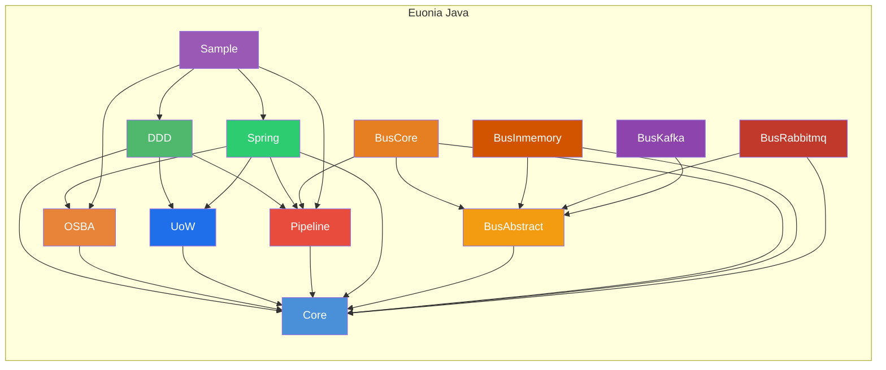

# Euonia（Java）

> *Eunoia* —— 源自希腊语 *εὔνοια*：美好的思维、善意、心态平和。

Euonia 是一个用于构建企业级 Java 应用的开发框架。它将**面向对象可扩展业务架构（OSBA）**与**领域驱动设计（DDD）**理念结合起来，为构建健壮、可维护的业务系统提供完整基础设施。该框架基于 **Java 17+**，并可与 **Spring Boot** 无缝集成。

Euonia 同时提供 **[.NET 版本](https://github.com/NerosoftDev/Euonia)**，本仓库为 **Java 版本**。

---

## 模块



### Core（euonia-core）
> 基础核心库：提供基类、ID 生成、反射工具、元组、HTTP 异常、安全能力与验证注解。

| 包 | 说明 |
|---------|-------------|
| `com.euonia.core` | 统一 `ObjectId`（支持 Snowflake、UUID、ULID、Random）、`SnowflakeId`、`ULID`、`ShortUniqueId`、`Singleton<T>`、`PriorityQueue`、`Pair<L,R>` |
| `com.euonia.tuple` | 不可变强类型元组：`Solo`、`Duet`、`Trio`、`Quartet`、`Quintet`、`Sextet`、`Septet`、`Octet`、`Nonet`、`Decet` |
| `com.euonia.http` | HTTP 状态异常：`BadRequestException`（400）、`UnauthorizedAccessException`（401）、`ForbiddenException`（403）、`ResourceNotFoundException`（404）、`ConflictException`（409）等 |
| `com.euonia.security` | `UserPrincipal`、`UserClaimTypes`、`AuthenticationException`、`CredentialException`、`UnauthorizedAccessException` |
| `com.euonia.annotation` | `@Required`、`@Validator`、`@Validation` —— 字段校验元数据 |
| `com.euonia.reflection` | `TypeHelper`、`GenericType<T>`、`@DisplayName` |

### DDD（euonia-domain-driven-design）
> 领域驱动设计抽象：实体、聚合、值对象、领域事件、应用服务、用例与审计支持。

| 包 | 类 | 作用 |
|---------|-------|---------|
| `com.euonia.domain` | `Entity<ID>` / `EntityBase<ID>` | 领域实体的接口与抽象基类（含标识） |
| `com.euonia.domain` | `Aggregate<ID>` / `AggregateBase<ID>` | 聚合根与领域事件管理（`raiseEvent`、`clearEvents`、`attachEvents`） |
| `com.euonia.domain` | `HasDomainEvents` | 管理领域事件和事件处理器的聚合契约 |
| `com.euonia.domain` | `ValueObject<T>` | 不可变值对象，基于反射实现 `equals`、`hashCode`、`compareTo` |
| `com.euonia.domain.event` | `Event` / `EventBase` | 核心事件契约：id、sequence、intent、originator 元数据 |
| `com.euonia.domain.event` | `DomainEvent` / `DomainEventBase` | 领域事件，支持聚合挂载与 `EventAggregate` 映射 |
| `com.euonia.domain.event` | `ApplicationEvent` / `ApplicationEventBase` | 应用层（集成）事件基类 |
| `com.euonia.domain.event` | `EventAggregate` | 聚合形态的事件数据：id、eventId、typeName、originator、timestamp、sequence |
| `com.euonia.domain.auditing` | `@Audited` / `AuditRecord` / `AuditStore` | 领域对象变更审计支持 |
| `com.euonia.application` | `ApplicationService` / `BaseApplicationService` | 应用服务标记接口与含依赖解析的基类 |
| `com.euonia.usecase` | `UseCase<I,O>` / `UseCasePresenter` | 输入/输出用例契约与响应式结果发布 |
| `com.euonia.usecase` | `UseCaseSuccess` / `UseCaseFailure` | 成功与失败输出端口 |

### UoW（euonia-unit-of-work）
> Unit of Work 抽象：定义事务边界、提交/回滚生命周期与一致性的持久化编排。

| 类 / 接口 | 作用 |
|-------------------|---------|
| `IUnitOfWork` | UoW 契约，包含生命周期方法（`saveChanges`、`commit`、`rollback`） |
| `IUnitOfWorkManager` | 创建并管理当前 UoW 作用域 |
| `UnitOfWork` | 默认 UoW 实现 |
| `UnitOfWorkBase` | 共享事务流程的基类 |
| `UnitOfWorkInterceptor` | 拦截应用流程并附加 UoW 边界 |
| `IUnitOfWorkAccessor` | 访问当前激活的 UoW 上下文 |

### Pipeline（euonia-pipeline）
> 受 ASP.NET Core 启发的中间件管道框架：统一的 `Pipeline<TRequest, TResponse>`，支持可链式的行为拼装、委托与依赖注入集成。

| 接口 / 类 | 说明 |
|-------------------|-------------|
| `Pipeline<TRequest, TResponse>` | 管道构建器：通过 `use()` 链接组件、构建委托并异步执行 |
| `PipelineBase<TRequest, TResponse>` | 抽象基类：组件注册、反向链构建、`@PipelineBehaviors` 注解支持 |
| `PipelineDelegate<TRequest, TResponse>` | `@FunctionalInterface`：`CompletionStage<TResponse> invoke(TRequest request)` |
| `PipelineBehavior<TRequest, TResponse>` | 行为接口：`CompletionStage<TResponse> handleAsync(TRequest, PipelineDelegate<TRequest, TResponse>)` |
| `PipelineFactory` / `DefaultPipelineFactory` | 创建 `Pipeline<TRequest, TResponse>` 的工厂 |
| `DefaultPipelineProvider<TRequest, TResponse>` | 默认实现，通过 `ServiceProvider` 解析行为（反射或 DI） |
| `@PipelineBehaviors` | 按上下文类型自动附加行为的注解 |

**关键特性：**
- Fluent API：支持通过 `.use()` 以 lambda、类或 `@PipelineBehaviors` 自动发现方式拼装行为
- 单一 `Pipeline<TRequest, TResponse>` 同时覆盖即发即忘（`Pipeline<Object, Void>`）和类型化请求/响应场景
- 基于委托的组合，采用反向链构建（最内层先执行）
- `ServiceProvider` 抽象支持独立运行与 Spring 集成
- 全链路异步（`CompletionStage`）

```java
// 创建一个管道
Pipeline<Object, Void> pipeline = new DefaultPipelineProvider<>(resolver)
    .use((ctx, next) -> next.invoke(ctx).thenRun(() -> System.out.println("Log: done")))
    .use(LoggingBehavior.class);

// 运行
pipeline.runAsync(new MyContext()).toCompletableFuture().join();
```

### Bus Abstract（euonia-bus-abstract）
> 消息总线抽象契约层：定义消息信封、上下文、约定、传输策略、注解与抽象传输接口。所有总线模块的扩展基础。依赖 `core`。

**核心契约**

| 类 / 接口 | 作用 |
|-------------------|---------|
| `RoutedMessage<T>` | 传输信封：负载 + messageId / correlationId / conversationId / requestTrackId / channel / authorization / timestamp / metadata |
| `MessageEnvelope` | 信封契约接口（messageId、correlationId、conversationId、requestTrackId、channel） |
| `MessageContext` | 运行时上下文：消息访问、响应发送（`response`）、失败通知（`failure`）、完成回调（`complete`） |
| `MessageContextBase` | `MessageContext` 默认实现：基于 `SubmissionPublisher` 的响应/完成事件流 |
| `MessageMetadata` | 强类型元数据映射（`Map<String,Object>`），支持 `get(key, Class<T>)` |
| `MessageHeaders` | 头信息常量：`MESSAGE_ID`、`CORRELATION_ID`、`CONVERSATION_ID`、`CONTENT_TYPE`、`REQUEST_TRACE_ID`、`AUTHORIZATION` |
| `HandlerContext` | 处理器上下文契约：订阅事件、异步调用（`handleAsync`） |
| `HandlerRegistration` | **Record** — 不可变注册元组：channel + messageType + handlerType + method |
| `Configurator` | 全局配置契约：约定构建器、策略构建器（按传输名）、处理器注册列表 |
| `Dispatcher` | 分发器契约：`List<String> determine(Class<?>)` — 消息类型 → 传输名列表 |
| `MessageConventionType` | 枚举：`NONE`、`UNICAST`、`MULTICAST`、`REQUEST` |
| `MessageSerializer` | 消息序列化契约（预留接口） |

**约定系统（消息类型分类）**

| 类 / 接口 | 作用 |
|-------------------|---------|
| `MessageConvention` | 契约：`isUnicastType`、`isMulticastType`、`isRequestType` |
| `DefaultMessageConvention` | 基于接口标记的约定：实现 `Unicast` / `Multicast` / `Request<R>` 接口 |
| `AnnotationMessageConvention` | 基于注解的约定：标注 `@Unicast` / `@Multicast` / `@Request` |
| `BaseMessageConvention` | 组合约定引擎：聚合多个约定，带 `ConcurrentHashMap` 缓存 |
| `OverridableMessageConvention` | 包装约定，支持谓词覆写分类结果 |
| `MessageConventionBuilder` | 流式构建器 |

**传输策略（消息路由）**

| 类 / 接口 | 作用 |
|-------------------|---------|
| `TransportStrategy` | 契约：`outgoing(Class<?>)`、`incoming(Class<?>)` |
| `BaseTransportStrategy` | 组合策略引擎：聚合多个策略，带缓存 |
| `DefaultTransportStrategy` | 中性默认策略（始终返回 `false`） |
| `AnnotationTransportStrategy` | 匹配 `@DispatchIn` / `@ReceiveIn` 注解 |
| `LocalMessageTransportStrategy` | 匹配 `@LocalMessage` 标注的类型 |
| `DistributedMessageTransportStrategy` | 匹配 `@DistributedMessage` 标注的类型 |
| `OverridableTransportStrategy` | 包装策略，支持谓词覆写 |

**契约接口（标记）**

| 接口 | 作用 |
|-----------|---------|
| `Unicast` | 标记接口：点对点单播消息 |
| `Multicast` | 标记接口：发布-订阅多播消息 |
| `Request<R>` | 标记接口：请求-响应消息，响应类型为 `R` |
| `Transport` | 传输抽象：`getName()`、`publishAsync`、`sendAsync`（void/typed）、`requestAsync` |

**接收者（Recipient）**

| 接口 | 作用 |
|-----------|---------|
| `Recipient` | 基础契约：`getName()`；继承 `AutoCloseable` |
| `Executor` | 标记子接口：单播/请求执行者 |
| `Subscriber` | 标记子接口：多播订阅者 |
| `RecipientRegistrar` | 接收者注册器：`register(List<HandlerRegistration>, defaultTransport)` |

**注解（十种）**

| 注解 | 目标 | 作用 |
|------|------|------|
| `@Subscribe` | 方法 | 声明处理器方法；`value` = 通道，`group` = 消费者组 |
| `@Channel` | 类型 | 覆盖默认通道名（默认全限定类名） |
| `@Unicast` | 类型 | 标记为单播消息 |
| `@Multicast` | 类型 | 标记为多播消息 |
| `@Request` | 类型 | 标记为请求-响应，含 `responseType()` |
| `@LocalMessage` | 类型 | 标记仅本地传输 |
| `@DistributedMessage` | 类型 | 标记仅分布式传输 |
| `@DispatchIn` | 类型 | 约束出站传输（`transports()`） |
| `@ReceiveIn` | 类型 | 约束入站传输（`transports()`） |
| `@Enqueue` | 类型 | 队列名 + 优先级 |

**事件体系**

| 类 | 作用 |
|---|------|
| `MessageProcessedEvent` | 基础事件：消息 + 上下文 + `MessageProcessType` |
| `MessageDeliveredEvent` | 消息已投递 |
| `MessageReceivedEvent` | 消息已接收 |
| `MessageAcknowledgedEvent` | 消息已确认 |
| `MessageRepliedEvent` | 消息已回复（含响应载荷） |
| `MessageHandledEvent` | 消息已处理（含处理器类型） |
| `MessageSubscribedEvent` | 订阅元数据 |
| `MessageProcessType` | 枚举：`SEND`、`DELIVERED`、`RECEIVED`、`ACKNOWLEDGED`、`REPLIED`、`HANDLED` |

**异常层次**

| 类 | 作用 |
|---|------|
| `MessageTypeException` | 无效/未分类的消息类型 |
| `MessageProcessingException` | 处理失败 |
| `MessageDeliverException` | 投递失败 |
| `MessageTransportException` | 传输层失败 |

### Bus Core（euonia-bus-core）
> 消息总线运行时编排层：处理器发现、注册、分发与总线 API。依赖 `bus-abstract` 和 `pipeline`，将所有抽象契约组合为可用的消息总线引擎。

**核心类**

| 类 / 接口 | 作用 |
|-------------------|---------|
| `Bus` | 顶层总线接口：`publishAsync`（多播）、`sendAsync`（单播/回调）、`callAsync`（请求-响应） |
| `MessageBus` | `Bus` 实现 — 编排引擎：类型校验 → 上下文解析 → 信封构建 → 管道执行 → 分发决策 → 传输投递 |
| `Handler<M,R>` | 类型化处理器：`R handle(M message, MessageContext context)` |
| `StrategicDispatcher` | `Dispatcher` 实现：策略匹配 + 基数校验 + 缓存，未匹配时回退到 `defaultTransport` |
| `DefaultHandlerContext` | `HandlerContext` 实现：通道维度处理器注册、异步调用（单处理器→响应/失败，多处理器→并行扇出） |
| `DefaultConfigurator` | `Configurator` 实现：流式配置约定/策略/处理器（四种注册方式：直接、类型、列表、包名） |
| `MessageHandlerFinder` | 自动发现：`@Subscribe` 注解方法 + `Handler<M,R>` 接口实现 |

**消息总线三类操作**

| 操作 | 方法 | 消息类型 | 传输策略 | 返回值 |
|------|------|----------|----------|--------|
| **发布** | `publishAsync` | `Multicast` | 多个传输并行发送 | `CompletableFuture<Void>` |
| **发送** | `sendAsync` | `Unicast` | 单个传输 | `CompletableFuture<Void>` 或含 `Flow.Subscriber<R>` |
| **调用** | `callAsync` | `Request<R>` | 单个传输 | `CompletableFuture<R>` |

**辅助类型**

| 类 | 作用 |
|----|------|
| `MessageBusOptions` | 总线全局选项：约定、策略、默认传输、管道行为开关 |
| `ExtendableOptions` | 选项基类：messageId / channel / queue / priority / requestTraceId |
| `PublishOptions` | 发布操作选项 |
| `SendOptions` | 发送操作选项（含 correlationId） |
| `CallOptions` | 调用操作选项（含 correlationId） |
| `PipelineMessage<M,R>` | 管道行为集成：绑定消息 + `Pipeline`，支持 `.use()` 追加行为 |
| `MessageCache` | 线程安全单例：消息类型 ↔ 通道名缓存（`@Channel` 优先，否则全限定类名） |
| `MessageHandler` / `MessageHandlerFactory` | 内部类型擦除处理器抽象与工厂 |

**关键特性：**
- 通过 `@Subscribe` 方法或 `Handler<M,R>` 接口自动发现处理器
- 单处理器通道支持请求/响应（Unicast / Request）；多处理器通道并行执行（Multicast）
- `TransportStrategy` 系统映射消息类型到传输方式（Local vs Distributed）
- 与 `Pipeline` 集成，支持中间件风格的消息处理（日志、验证、转换等）

### Bus InMemory（euonia-bus-inmemory）
> 进程内内存传输适配器 — 完整的 `Transport` 实现。提供无需外部中间件的纯内存消息分发，适用于开发测试、单进程集成及超低延迟场景。依赖 `bus-abstract` 和 `core`。

**核心类**

| 类 | 作用 |
|----|------|
| `InMemoryTransport` | `Transport` 实现：`publishAsync` → `WeakReferenceMessenger`；`sendAsync` / `requestAsync` → `StrongReferenceMessenger` |
| `InMemoryRecipientRegistrar` | `RecipientRegistrar` 实现：按 `MessageConvention` 分类，将处理器注册映射为接收者 + 信使注册 |
| `InMemoryRecipient` | 接收者基类：receive → ReceivedEvent → handleAsync → AcknowledgedEvent |
| `InMemoryUnicastRecipient` | `Executor`：单播接收者 |
| `InMemoryMulticastRecipient` | `Subscriber`：多播接收者 |
| `InMemoryRequestRecipient` | `Executor`：请求-响应接收者 |
| `MessagePack` | 传输信封：`RoutedMessage` + `MessageContext` + aborted 标志 |

**信使引擎（Messenger）**

| 类 | 引用类型 | 用途 |
|----|----------|------|
| `StrongReferenceMessenger` | 强引用 | Unicast / Request —— 按消息类精确匹配，快照迭代，身份键防重复 |
| `WeakReferenceMessenger` | `WeakReference` | Multicast —— 弱引用接收者，GC 自动退订，`cleanup` 扫描清理 |

**映射规则：** `Unicast` → `InMemoryUnicastRecipient` → StrongMessenger；`Multicast` → `InMemoryMulticastRecipient` → WeakMessenger；`Request` → `InMemoryRequestRecipient` → StrongMessenger。

### Bus RabbitMQ（euonia-bus-rabbitmq）
> RabbitMQ 传输适配器（脚手架阶段）。声明 `RabbitMqTransport implements Transport`，持有 `com.rabbitmq.client.ConnectionFactory`。依赖 `bus-abstract`、`core` 和 `com.rabbitmq:amqp-client:5.31.0`。

| 状态 | 说明 |
|------|------|
| ✅ 已实现 | `getName()` 返回类名；`ConnectionFactory` 字段初始化 |
| 🚧 待实现 | `publishAsync` / `sendAsync` / `requestAsync` 返回 null；缺少队列/交换器/路由键映射、消息序列化、连接生命周期管理、请求-响应关联 |

### Bus Kafka（euonia-bus-kafka）
> Kafka 传输适配器（占位模块）。声明 `bus-abstract` 依赖，无 Java 源码，无 Kafka 客户端依赖。待实现 `Transport` 接口并通过 Apache Kafka 提供分布式消息分发。

### Spring（euonia-spring）
> Spring 集成模块。通过 `ApplicationContext` 与 `ServiceProvider` 建立桥接，为 Pipeline 及其它 Euonia 组件提供无缝依赖注入。

| 类 | 说明 |
|-------|-------------|
| `ApplicationContextServiceProvider` | 基于 Spring `ApplicationContext` 的 `ServiceProvider` 实现，支持 `getBeanProvider`、`autowireBean` 与构造参数创建 |
| `ServiceProviderConfiguration` | Spring `@Configuration`，自动注册 `ServiceProvider` Bean |

**关键特性：**
- 为 Pipeline 与其它 Euonia 组件提供 Spring DI 能力
- 自动注入 Spring 管理的 Bean 到 Pipeline 委托/行为
- 提供带自动装配的反射构建兜底能力
- 极简接入：`@Import(ServiceProviderConfiguration.class)` 或组件扫描

### OSBA（euonia-osba）
> **面向对象可扩展业务架构**：提供富业务对象模型，支持规则校验、属性变更追踪、状态管理与反射驱动工厂。

#### 业务对象层级

```
BusinessObject<B>          — 核心：规则、上下文、属性管理
    └── ObservableObject<T>  — 状态跟踪：NEW / CHANGED / DELETED
        ├── EditableObject<T>  — 支持异步规则校验与保存
        ├── ReadOnlyObject<T>  — 带权限控制的只读对象
        └── ExecutableObject<T> — 模板化执行对象
```

#### 核心概念

| 概念 | 说明 |
|---------|-------------|
| **BusinessContext** | 服务定位与对象工厂上下文；负责注入上下文与初始化规则 |
| **PropertyInfo<T>** | 强类型属性元数据：名称、类型、友好名、默认值、字段引用 |
| **FieldDataManager** | 实例级反射字段值管理 |
| **Rule System** | 异步规则校验，基于 `RuleManager`（类型级单例）与 `Rules`（实例级执行器） |
| **ObjectEditState** | 生命周期状态机：`NONE → NEW → CHANGED → DELETED` |
| **ObjectFactory** | 反射驱动 CRUD 工厂：`@FactoryCreate`、`@FactoryFetch`、`@FactoryInsert`、`@FactoryUpdate`、`@FactoryDelete`、`@FactoryExecute` |

#### 规则系统

```java
protected void addRules() {
    getRules().addRule(new LambdaRule<>(age, (a, ctx) -> a != null && a >= 18, "Must be 18+"));
}
```

| 类 | 说明 |
|-------|-------------|
| `Rule` | 接口：`getName()`、`getProperty()`、`getPriority()`、`executeAsync(RuleContext)` |
| `LambdaRule<T>` | 基于 Lambda：`(value, context) → boolean` |
| `RegularRule` | 基于方法执行 |
| `RequiredRule` | 非空属性校验 |
| `BrokenRule` / `BrokenRuleCollection` | 校验结果集合，含严重级别（ERROR/WARNING/INFO） |
| `RuleCheckException` | 校验失败时抛出 |

---

## 示例应用

`sample` 模块演示了 **Euonia 与 Spring Boot 4.0 的集成**：

| 组件 | 说明 |
|-----------|-------------|
| **`User` 聚合** | 基于 `EditableObject<User>`，使用 `@FactoryCreate`、自定义规则（`UserNameRule`、`LambdaRule`）与 Snowflake ID |
| **`OsbaConfiguration`** | 将 `BusinessObjectFactory` 绑定到 Spring `ApplicationContext` |
| **`UserController`** | REST API：`POST /api/user`、`GET /api/user/{id}`，通过 `ObjectFactory` 创建/查询聚合 |

### 技术栈

| 类别 | 技术 |
|----------|-----------|
| **语言** | Java 17+（sample 使用 Java 25） |
| **框架** | Spring Boot 4.0（Spring MVC、Spring Data JPA、Spring Framework 7.0） |
| **数据库** | MySQL、H2（内存模式） |
| **API 文档** | SpringDoc OpenAPI 3.0 |
| **构建** | Maven |
| **ID 生成** | Snowflake、UUID、ULID |
| **Pipeline** | 自定义中间件管道（责任链 / middleware 模式） |
| **DI 集成** | 基于 `ServiceProvider` 的 Spring `ApplicationContext` 集成 |

---

## 快速开始

### Maven 依赖

```xml
<!-- 核心工具 -->
<dependency>
    <groupId>com.euonia</groupId>
    <artifactId>core</artifactId>
    <version>1.0.0</version>
</dependency>

<!-- Pipeline 中间件 -->
<dependency>
    <groupId>com.euonia</groupId>
    <artifactId>pipeline</artifactId>
    <version>1.0.0</version>
</dependency>

<!-- Spring 集成 -->
<dependency>
    <groupId>com.euonia</groupId>
    <artifactId>spring</artifactId>
    <version>1.0.0</version>
</dependency>

<!-- 业务对象（OSBA） -->
<dependency>
    <groupId>com.euonia</groupId>
    <artifactId>osba</artifactId>
    <version>1.0.0</version>
</dependency>

<!-- 领域驱动设计（DDD） -->
<dependency>
    <groupId>com.euonia</groupId>
    <artifactId>domain-driven-design</artifactId>
    <version>1.0.0</version>
</dependency>

<!-- 消息总线（抽象层） -->
<dependency>
    <groupId>com.euonia</groupId>
    <artifactId>bus-abstract</artifactId>
    <version>1.0.0</version>
</dependency>

<!-- 消息总线（核心运行时） -->
<dependency>
    <groupId>com.euonia</groupId>
    <artifactId>bus-core</artifactId>
    <version>1.0.0</version>
</dependency>

<!-- 消息总线（内存传输） -->
<dependency>
    <groupId>com.euonia</groupId>
    <artifactId>bus-inmemory</artifactId>
    <version>1.0.0</version>
</dependency>

<!-- 消息总线（RabbitMQ 传输） -->
<dependency>
    <groupId>com.euonia</groupId>
    <artifactId>bus-rabbitmq</artifactId>
    <version>1.0.0</version>
</dependency>

<!-- 消息总线（Kafka 传输） -->
<dependency>
    <groupId>com.euonia</groupId>
    <artifactId>bus-kafka</artifactId>
    <version>1.0.0</version>
</dependency>
```

```java
// 定义业务对象
@Component @Scope("prototype")
public class Order extends EditableObject<Order> {
    private final PropertyInfo<String> productName = registerProperty(String.class, "productName");

    @FactoryCreate
    protected void create(String productName) {
        super.create();
        setProductName(productName);
        setId(ObjectId.snowflake().getValue(Long.class));
    }

    @Override
    protected void addRules() {
        getRules().addRule(new RequiredRule(productName));
    }
}

// 使用工厂
@Autowired
private ObjectFactory factory;

var order = factory.create(Order.class, "Widget");
order.save(false);
```

---

## 构建

```bash
# 构建全部模块
mvn clean install

# 运行示例应用
cd sample
mvn spring-boot:run
```

---

## 项目链接

- **GitHub**: [github.com/NerosoftDev/euonia-java](https://github.com/NerosoftDev/euonia-java)
- **.NET 版本**: [github.com/NerosoftDev/Euonia](https://github.com/NerosoftDev/Euonia)

---

## 赞助


---

[](https://www.jetbrains.com/)

感谢 [JetBrains](https://www.jetbrains.com/) 通过其 [开源免费许可证计划](https://www.jetbrains.com/community/opensource) 提供 [全家桶产品支持](https://www.jetbrains.com/products.html)。

---


