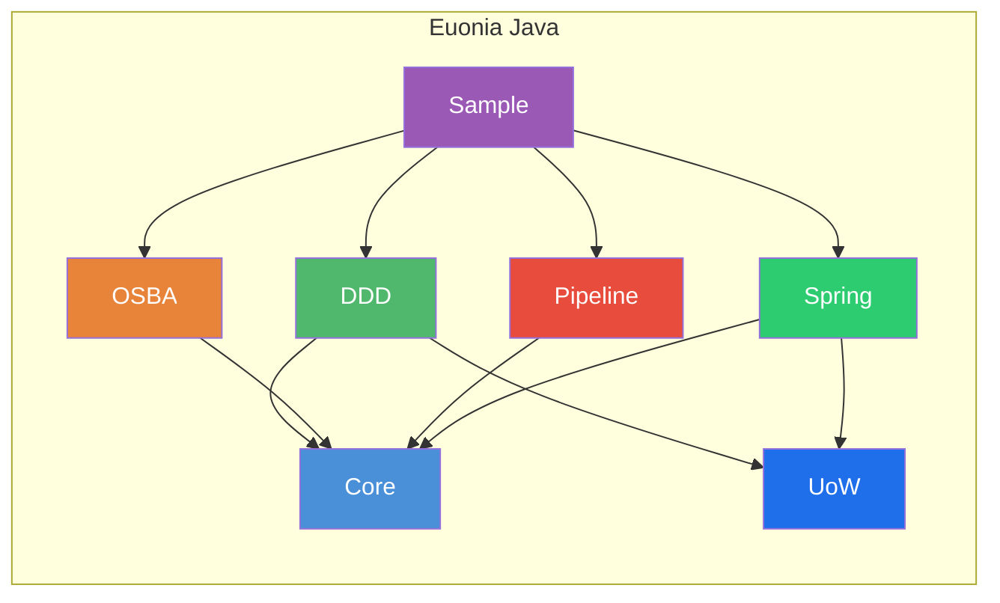

# Euonia（Java）

> *Eunoia* —— 源自希腊语 *εὔνοια*：美好的思维、善意、心态平和。

Euonia 是一个用于构建企业级 Java 应用的开发框架。它将**面向对象可扩展业务架构（OSBA）**与**领域驱动设计（DDD）**理念结合起来，为构建健壮、可维护的业务系统提供完整基础设施。该框架基于 **Java 17+**，并可与 **Spring Boot** 无缝集成。

Euonia 同时提供 **[.NET 版本](https://github.com/NerosoftDev/Euonia)**，本仓库为 **Java 版本**。

---

## 模块



### Core（euonia-core）
> 基础核心库：提供基类、ID 生成、反射工具、元组、HTTP 异常、安全能力与验证注解。

| 包 | 说明 |
|---------|-------------|
| `com.euonia.core` | 统一 `ObjectId`（支持 Snowflake、UUID、ULID、Random）、`SnowflakeId`、`ULID`、`ShortUniqueId`、`Singleton<T>`、`PriorityQueue`、`Pair<L,R>` |
| `com.euonia.tuple` | 不可变强类型元组：`Solo`、`Duet`、`Trio`、`Quartet`、`Quintet`、`Sextet`、`Septet`、`Octet`、`Nonet`、`Decet` |
| `com.euonia.http` | HTTP 状态异常：`BadRequestException`（400）、`UnauthorizedAccessException`（401）、`ForbiddenException`（403）、`ResourceNotFoundException`（404）、`ConflictException`（409）等 |
| `com.euonia.security` | `UserPrincipal`、`UserClaimTypes`、`AuthenticationException`、`CredentialException`、`UnauthorizedAccessException` |
| `com.euonia.annotation` | `@Required`、`@Validator`、`@Validation` —— 字段校验元数据 |
| `com.euonia.reflection` | `TypeHelper`、`GenericType<T>`、`@DisplayName` |

### DDD（euonia-domain-driven-design）
> 领域驱动设计抽象：实体、聚合、值对象、领域事件与审计支持。

| 类 | 作用 |
|-------|---------|
| `Entity<ID>` / `EntityBase<ID>` | 领域实体的接口与抽象基类（含标识） |
| `Aggregate<ID>` / `AggregateBase<ID>` | 聚合根与领域事件管理（`raiseEvent`、`clearEvents`、`attachEvents`） |
| `ValueObject<T>` | 不可变值对象，基于反射实现 `equals`、`hashCode`、`compareTo` |
| `DomainEvent` / `DomainEventBase` | 领域事件契约，支持聚合挂载与事件元数据 |
| `ApplicationEvent` / `ApplicationEventBase` | 应用层事件基类 |
| `EventAggregate` | 事件元数据封装：id、eventId、typeName、originator、timestamp、sequence |
| `@Audited` / `AuditRecord` / `AuditStore` | 领域对象变更审计支持 |

### UoW（euonia-unit-of-work）
> Unit of Work 抽象：定义事务边界、提交/回滚生命周期与一致性的持久化编排。

| 类 / 接口 | 作用 |
|-------------------|---------|
| `IUnitOfWork` | UoW 契约，包含生命周期方法（`saveChanges`、`commit`、`rollback`） |
| `IUnitOfWorkManager` | 创建并管理当前 UoW 作用域 |
| `UnitOfWork` | 默认 UoW 实现 |
| `UnitOfWorkBase` | 共享事务流程的基类 |
| `UnitOfWorkInterceptor` | 拦截应用流程并附加 UoW 边界 |
| `IUnitOfWorkAccessor` | 访问当前激活的 UoW 上下文 |

### Pipeline（euonia-pipeline）
> 受 ASP.NET Core 启发的中间件管道框架：支持可链式的请求/响应处理、行为、委托与依赖注入集成。

| 接口 / 类 | 说明 |
|-------------------|-------------|
| `Pipeline` | 管道构建器：通过 `use()` 链接组件、构建委托并异步执行 |
| `PipelineBase` | 抽象基类：组件注册、反向链构建、`@PipelineBehaviors` 注解支持 |
| `PipelineDelegate` | `FunctionalInterface`：`CompletionStage<Void> invoke(Object context)` |
| `PipelineBehavior` | 行为接口：`CompletionStage<Void> handleAsync(Object, PipelineDelegate)` |
| `PipelineFactory` / `DefaultPipelineFactory` | 创建 `Pipeline` 与 `RequestResponsePipeline` 的工厂 |
| `DefaultPipelineProvider` | 默认实现，通过 `ServiceResolver` 解析行为（反射或 DI） |
| `RequestResponsePipeline<TRequest, TResponse>` | 强类型请求/响应管道，支持 `runAsync(TRequest)` |
| `RequestResponsePipelineBase<TRequest, TResponse>` | 强类型管道抽象基类 |
| `RequestResponsePipelineBehavior<TRequest, TResponse>` | 强类型行为：`handleAsync(TRequest, PipelineDelegate)` |
| `RequestResponsePipelineDelegate<TRequest, TResponse>` | 强类型委托：`CompletionStage<TResponse> invoke(TRequest)` |
| `RequestPipelineDelegate<TRequest>` | 无返回的强类型委托：`CompletionStage<Void> invoke(TRequest)` |
| `@PipelineBehaviors` | 按上下文类型自动附加行为的注解 |

**关键特性：**
- Fluent API：支持通过 `.use()` 以 lambda、类或 `@PipelineBehaviors` 自动发现方式拼装行为
- 同时支持无返回管道（`Pipeline`）和请求/响应管道（`RequestResponsePipeline`）
- 基于委托的组合，采用反向链构建（最内层先执行）
- `ServiceResolver` 抽象支持独立运行与 Spring 集成
- 全链路异步（`CompletionStage`）

```java
// 创建一个管道
Pipeline pipeline = new DefaultPipelineProvider(resolver)
    .use((ctx, next) -> next.invoke(ctx).thenRun(() -> System.out.println("Log: done")))
    .use(LoggingBehavior.class);

// 运行
pipeline.runAsync(new MyContext()).toCompletableFuture().join();
```

### Spring（euonia-spring）
> Spring 集成模块。通过 `ApplicationContext` 与 `ServiceResolver` 建立桥接，为 Pipeline 及其它 Euonia 组件提供无缝依赖注入。

| 类 | 说明 |
|-------|-------------|
| `ApplicationContextServiceResolver` | 基于 Spring `ApplicationContext` 的 `ServiceResolver` 实现，支持 `getBeanProvider`、`autowireBean` 与构造参数创建 |
| `ServiceResolverConfiguration` | Spring `@Configuration`，自动注册 `ServiceResolver` Bean |

**关键特性：**
- 为 Pipeline 与其它 Euonia 组件提供 Spring DI 能力
- 自动注入 Spring 管理的 Bean 到 Pipeline 委托/行为
- 提供带自动装配的反射构建兜底能力
- 极简接入：`@Import(ServiceResolverConfiguration.class)` 或组件扫描

### OSBA（euonia-osba）
> **面向对象可扩展业务架构**：提供富业务对象模型，支持规则校验、属性变更追踪、状态管理与反射驱动工厂。

#### 业务对象层级

```
BusinessObject<B>          — 核心：规则、上下文、属性管理
    └── ObservableObject<T>  — 状态跟踪：NEW / CHANGED / DELETED
        ├── EditableObject<T>  — 支持异步规则校验与保存
        ├── ReadOnlyObject<T>  — 带权限控制的只读对象
        └── ExecutableObject<T> — 模板化执行对象
```

#### 核心概念

| 概念 | 说明 |
|---------|-------------|
| **BusinessContext** | 服务定位与对象工厂上下文；负责注入上下文与初始化规则 |
| **PropertyInfo<T>** | 强类型属性元数据：名称、类型、友好名、默认值、字段引用 |
| **FieldDataManager** | 实例级反射字段值管理 |
| **Rule System** | 异步规则校验，基于 `RuleManager`（类型级单例）与 `Rules`（实例级执行器） |
| **ObjectEditState** | 生命周期状态机：`NONE → NEW → CHANGED → DELETED` |
| **ObjectFactory** | 反射驱动 CRUD 工厂：`@FactoryCreate`、`@FactoryFetch`、`@FactoryInsert`、`@FactoryUpdate`、`@FactoryDelete`、`@FactoryExecute` |

#### 规则系统

```java
protected void addRules() {
    getRules().addRule(new LambdaRule<>(age, (a, ctx) -> a != null && a >= 18, "Must be 18+"));
}
```

| 类 | 说明 |
|-------|-------------|
| `Rule` | 接口：`getName()`、`getProperty()`、`getPriority()`、`executeAsync(RuleContext)` |
| `LambdaRule<T>` | 基于 Lambda：`(value, context) → boolean` |
| `RegularRule` | 基于方法执行 |
| `RequiredRule` | 非空属性校验 |
| `BrokenRule` / `BrokenRuleCollection` | 校验结果集合，含严重级别（ERROR/WARNING/INFO） |
| `RuleCheckException` | 校验失败时抛出 |

---

## 示例应用

`sample` 模块演示了 **Euonia 与 Spring Boot 4.0 的集成**：

| 组件 | 说明 |
|-----------|-------------|
| **`User` 聚合** | 基于 `EditableObject<User>`，使用 `@FactoryCreate`、自定义规则（`UserNameRule`、`LambdaRule`）与 Snowflake ID |
| **`OsbaConfiguration`** | 将 `BusinessObjectFactory` 绑定到 Spring `ApplicationContext` |
| **`UserController`** | REST API：`POST /api/user`、`GET /api/user/{id}`，通过 `ObjectFactory` 创建/查询聚合 |

### 技术栈

| 类别 | 技术 |
|----------|-----------|
| **语言** | Java 17+（sample 使用 Java 25） |
| **框架** | Spring Boot 4.0（Spring MVC、Spring Data JPA、Spring Framework 7.0） |
| **数据库** | MySQL、H2（内存模式） |
| **API 文档** | SpringDoc OpenAPI 3.0 |
| **构建** | Maven |
| **ID 生成** | Snowflake、UUID、ULID |
| **Pipeline** | 自定义中间件管道（责任链 / middleware 模式） |
| **DI 集成** | 基于 `ServiceResolver` 的 Spring `ApplicationContext` 集成 |

---

## 快速开始

### Maven 依赖

```xml
<!-- 核心工具 -->
<dependency>
    <groupId>com.euonia</groupId>
    <artifactId>core</artifactId>
    <version>1.0.0</version>
</dependency>

<!-- Pipeline 中间件 -->
<dependency>
    <groupId>com.euonia</groupId>
    <artifactId>pipeline</artifactId>
    <version>1.0.0</version>
</dependency>

<!-- Spring 集成 -->
<dependency>
    <groupId>com.euonia</groupId>
    <artifactId>spring</artifactId>
    <version>1.0.0</version>
</dependency>

<!-- 业务对象（OSBA） -->
<dependency>
    <groupId>com.euonia</groupId>
    <artifactId>osba</artifactId>
    <version>1.0.0</version>
</dependency>

<!-- 领域驱动设计（DDD） -->
<dependency>
    <groupId>com.euonia</groupId>
    <artifactId>domain-driven-design</artifactId>
    <version>1.0.0</version>
</dependency>
```

```java
// 定义业务对象
@Component @Scope("prototype")
public class Order extends EditableObject<Order> {
    private final PropertyInfo<String> productName = registerProperty(String.class, "productName");

    @FactoryCreate
    protected void create(String productName) {
        super.create();
        setProductName(productName);
        setId(ObjectId.snowflake().getValue(Long.class));
    }

    @Override
    protected void addRules() {
        getRules().addRule(new RequiredRule(productName));
    }
}

// 使用工厂
@Autowired
private ObjectFactory factory;

var order = factory.create(Order.class, "Widget");
order.save(false);
```

---

## 构建

```bash
# 构建全部模块
mvn clean install

# 运行示例应用
cd sample
mvn spring-boot:run
```

---

## 项目链接

- **GitHub**: [github.com/NerosoftDev/euonia-java](https://github.com/NerosoftDev/euonia-java)
- **.NET 版本**: [github.com/NerosoftDev/Euonia](https://github.com/NerosoftDev/Euonia)

---

## 赞助


---

[](https://www.jetbrains.com/)

感谢 [JetBrains](https://www.jetbrains.com/) 通过其 [开源免费许可证计划](https://www.jetbrains.com/community/opensource) 提供 [全家桶产品支持](https://www.jetbrains.com/products.html)。

---


